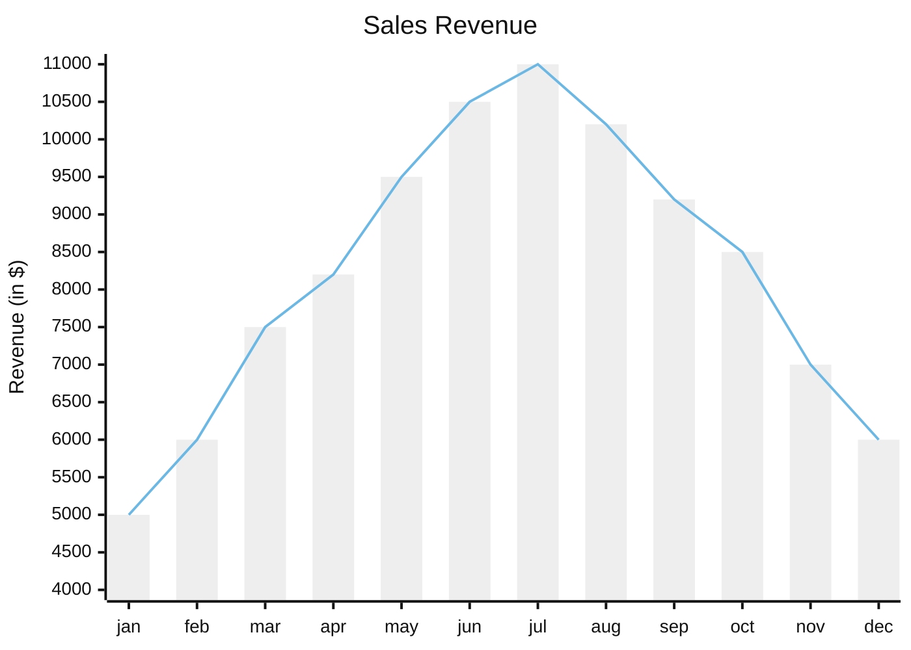

# ikinci

  59

$ x_{2} + x_{3} = 5^2 $

# Dashboard

sadasda





```mermaid!
---
config:
  look: handDrawn
  theme: neutral
---
xychart-beta
    title "Sales Revenue"
    x-axis [jan, feb, mar, apr, may, jun, jul, aug, sep, oct, nov, dec]
    y-axis "Revenue (in $)" 4000 --> 11000
    bar [5000, 6000, 7500, 8200, 9500, 10500, 11000, 10200, 9200, 8500, 7000, 6000]
    line [5000, 6000, 7500, 8200, 9500, 10500, 11000, 10200, 9200, 8500, 7000, 6000]
```

dasdasfads

## deneme

### deneme

#### deneme