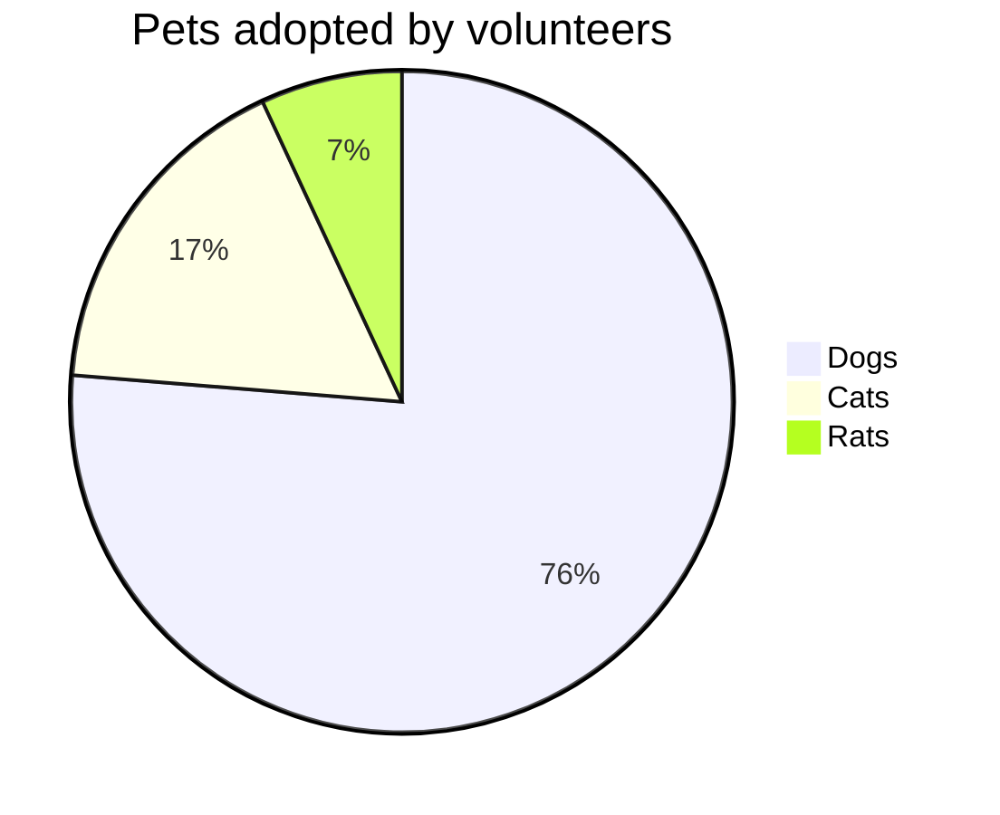

İnsanın kendi ile çelişmesi benim için önemli bir şeydir. Gelişimin parçalarından biri olarak görürüm hep. Buradaki çelişkiden kastım çok bariz bir çelişki yerine, insanın kendiyle kurduğu diyalog tarafından yola çıkarak söylüyorum.

Burada aslında kendime karşı bir önkoşul hazırlıyorum. Ben kendimle sürekli çelişen bir insanım ve bundan aslında çok da müzdarip değilim. En azından soruglama adına hâlâ bir şeyler yapabildiğimin göstergesi olarak görüyorum. Demem o ki ben bunları yazarken de çelişebilirim ve bu gayet normaldir.

Bu notların amacı ileride baktığımda neler düşündüğümü görmek istememden kaynaklanıyor. Bunu halka açık yapmak ne kadar mantıklıdır bilmem fakat şuan için bunu çok da önemsediğim söylenemez.

Eskiden çok fazla yaptığım bir alışkanlığımı da bu yazılar sayesinde geri kazanmak istiyorum. Hayatım boyunca okumaktan ve yazmaktan hep çok zevk aldım. Bunu çevremdekilerle çok paylaşmasam da çevremdekiler en azından kendi başıma bir şeyler yaptığımı bilirler. **Edebiyat**, **Etimoloji**, **Felsefe**, **Psikoloji**, **Sosyoloji ve Antropoloji**, **Sinema**, **Müzik** gibi konularda genel olarak sosyal bilimler temelli konularda yazılar yazmaya çalışacağım. Belki çok fazla revize edeceğim bu yazıları, ne kadar çok yazmaya çalışıyor olsam da ben yazar değilim ve bu konuda toyluğum barizdir. Ayrıca bilgim de yetersizdir.

> Bunların sadece kendime notlar olduğunu unutmayın

Yazılarım için takipte kalın! 😊

# Hybrid HTML with Markdown is a not bad choice ^\_^

## Table Usage

| denem | 1   | 2   |
| ----- | --- | --- |
| sa    | as  | sa  |
| sa    | as  | sa  |

## PlantUML Usage

@startuml
Bob -> Alice : hello
@enduml

$ \int_a^b f(x)\,dx $

## Video Usage

